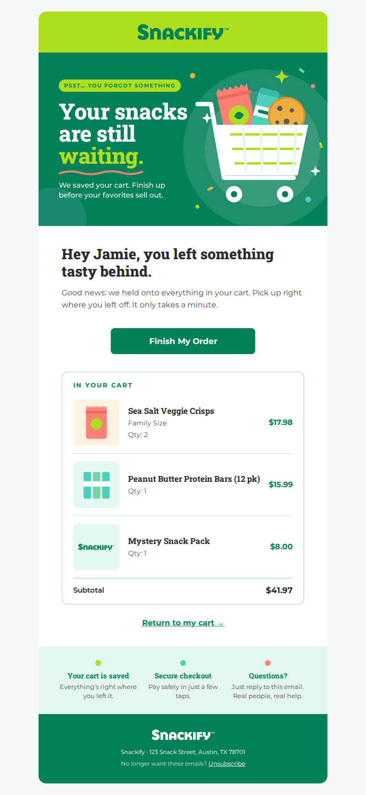
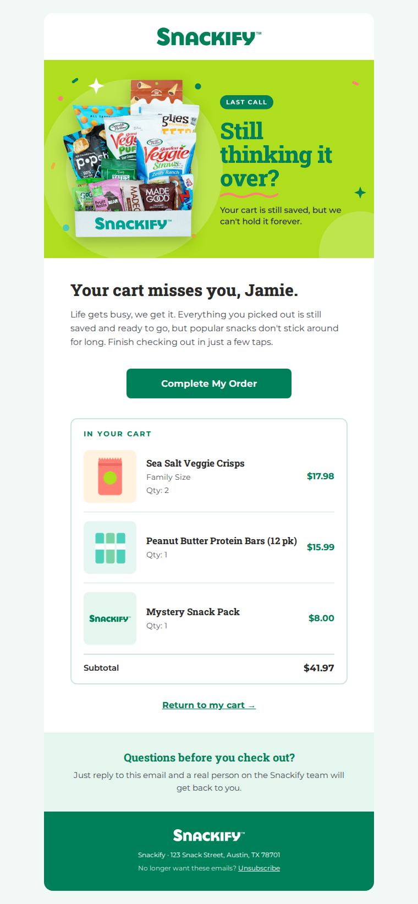

# Snackify: Abandoned Checkout flow (2026 refresh)

This is a two-email abandoned checkout flow based on the Snackify brand sheet. Each email has a dynamic cart block and a hero image in the brand colors. See **[FLOW.md](FLOW.md)** for the flow setup, timing, subject lines and launch checklist.

| Email 1 (1 hour) | Email 2 (1 day later) |
| --- | --- |
|  |  |

## Files

| File | What it is |
| --- | --- |
| `abandoned-checkout.html` | Email 1 Klaviyo code template. Image URLs are placeholder tokens (`__HERO_URL__` and similar) that `push_to_klaviyo.py` fills in. |
| `abandoned-checkout-reminder.html` | Email 2 (reminder) Klaviyo code template. It uses the same tokens plus `__HERO_REMINDER_URL__`. |
| `FLOW.md` | Flow blueprint: trigger, filters, delays, subject lines and launch checklist. |
| `images/` | Heroes for both emails (1200×720, shown at 600×360), logos in green and white, and a fallback product tile. |
| `preview*.html`, `preview*.png` | Both emails rendered with a sample 3-item cart, on desktop and mobile. |
| `push_to_klaviyo.py` | Uploads the images and creates both templates through the Klaviyo API. It doesn't create or change any flow. |
| `source/` | Hero image sources (`hero.html`, `hero-reminder.html`, `snack-box.png`), the preview builder and the renderer. |

## Dynamic product block

Both templates use Shopify's **Started Checkout** event data, so the flow must be triggered by that metric:

- Loops over `event.extra.line_items`, showing each item's image (`item.product.images.0.src`), title, variant (hidden when it's "Default Title"), quantity and line price.
- If an item has no image, it shows the Snackify fallback tile.
- The subtotal comes from `event|lookup:'$value'`.
- Every button, image and product row links to `event.extra.responsive_checkout_url`.
- The greeting uses `person.first_name`, with "there" (Email 1) or "friend" (Email 2) as the fallback.

## Brand mapping

- **Colors:** lime `#AEDE1D` Email 1 header and Email 2 hero, and green `#008059` Email 1 hero, CTA and footer (the brand's two logo variations). Headlines are `#2A2A2A`, body text is `#4B5058` / `#58595B` and dividers are the green 20% tint `#CCE6DE`. The mint tint `#E4F6ED` is the reassurance-strip background, and the secondary and accent colors (`#4DD0BA`, `#FF8075`, `#F1AF40`, `#77D3A6`) are used for the confetti and bullet dots.
- **Fonts:** headings use Museo Slab and body/buttons use Proxima Nova, as the brand sheet specifies. Neither is a free web font, so the template falls back to Roboto Slab and Montserrat (Google Fonts) and then to Rockwell/Georgia and Helvetica/Arial. The hero image uses Roboto Slab and Montserrat.

## Publishing

```bash
KLAVIYO_API_KEY=pk_xxx python3 push_to_klaviyo.py   # add --dry-run to test without a key
```

The API key needs **Images: write** and **Templates: write**. After the templates are created, build the flow and launch it using the checklist in [FLOW.md](FLOW.md).

## Rebuilding previews and hero images

```bash
pip install jinja2 && npm i playwright
python3 source/build_preview.py && node source/render.js
```
